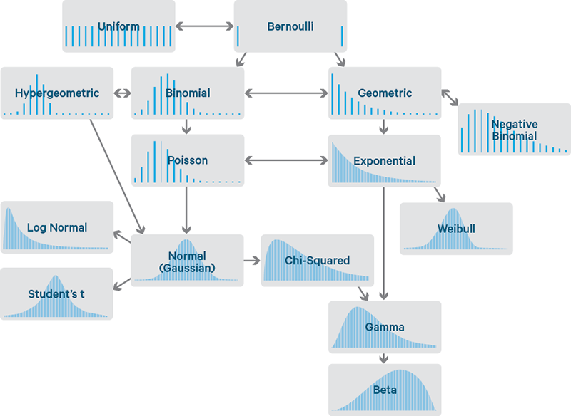

# Statistical Distributions and Their Use Cases

## Introduction

Data scientists have to choose probability distributions routinely. This includes selecting which distribution is most representative of the given data, in order to conduct an analytics experiment such as A/B testing. Distributions are to statistical analysis what data structures are to computer programming. There are literally thousands of distributions to study, although most of them are not very common. In the upcoming series of lessons, we will look at ways to analyze common distributions you are apt to encounter.

## Objectives

You will be able to:

* Understand the concept of statistical distributions
* Differentiate between discrete and continuous distributions
* Understand commonly used distributions and their use cases

## What is a "Statistical Distribution" ?

The statistical distributions show all the possible values of the data and how often they occur. For example, we can view the raw frequency of events or the percentage of time each event occurs.

When talking about distributions, we also make the distinction between **discrete** and **continuous** variables. Discrete data can only take on set values, while continuous data can take on any possible value within a range. The outcomes from rolling a dice or tossing a coin are discrete; in the first case possible values are 1-6 while in the second options are Heads or Tails (often such binary variables are coded as 0/1). In contrast, a quantity such as temperature can take on any value within a certain range. The temperature could not only be 20 degrees, 21 degrees or 22 degrees, but it could also be 20.5, 20.05, 20.005, etc. leading to infinite possibilities. 

When dealing with **discrete** data we use a **probability mass function (PMF)**. When dealing with **continuous** data, we use a **probability density function (PDF)**.

Based on the variation of their attributes, data distributions can take many shapes and forms. The key parameters to describe random variables as distrubtions are statistical mean and variance of random data variable. Statistical variance gives a measure of how the data distributes itself about the Statistical Mean (or the **Expected Value** of data). Specifically, the variance measures the average distance of how far data points are from the mean of the data.

## Common Distributions

Here you can see the general shapes of some common distributions. The horizontal axis in each chart is set of possible numeric outcomes. The vertical axis describes the probability of outcomes. 

Let's quickly talk about some common distributions and their use cases below:

## Discrete Distributions

### The Bernoulli Distribution 

(The Bernoulli distribution is also called the binomial distribution.)

The bernoulli distribution represents the probability of $x$ successes in $n$ trials for a binomial variable (only 2 cases). Lots of textbooks use coin flipping examples, but the two outcomes can also have different probabilities such as the chance of success being 20%.

### Geometric
The geometric distribution also deals with repeated trials from a binomial variable. Rather then investigate the probability of $x$ successes in $n$ trials, the geometric distribution examines the probability that the first success will occur on trial n. 

### Poisson

The Poisson distribution represents the probability of n events in a given time period when the overall rate of occurence is constant. The classic example is pieces of mail. If your overall mail received is constant, the number of items received on a single day (or month) is apt to follow a poisson distribution. Other examples might include visitors arriving on a website, or customers arrive at a store, or clients waiting to be served in some kind of queue.

### Uniform Distribution

The uniform distribution occurs when all possible outcomes are equally likely. An example might include the probability of a train arriving at any given time, or the probabilities for rolling a 1-6 on a single die. The uniform distribution is both a continuous and discrete distribution, occuring in both contexts. 

### Continuous Distributions

#### The Normal or Gaussian distribution

A normal distribution is the single most important distribution for data analysis. Its bell shape is instantly recognizable as seen in the diagram above. A normal distribution turns up very often when dealing with real world data including heights, weights of different people, errors in some measurement or marks on a test.

## So is that all about distributions?

The phenomena of statistical distributions carries a lot more depth and detail. This lesson gives you an initial introduction to different distributions. The significance and applications of these distributions will come with time as we proceed with analytics activities. For now, we shall carry on looking at the normal distribution in more detail in the upcoming lessons.

## Summary

In this lesson, we discussed the concept of statistical distribution as well as some common ones which we will examine in further detail.
